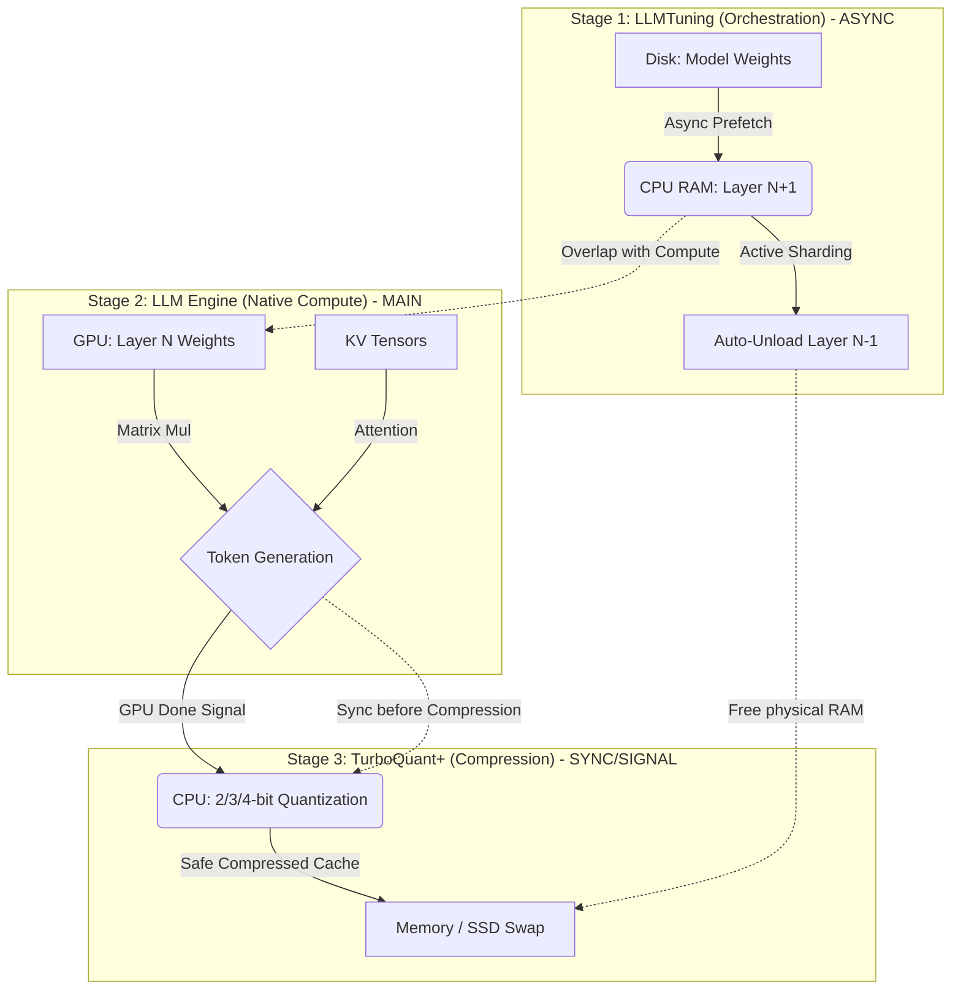

# TurboQuant+ Architectural Map 🗺️

This document maps the interaction between the three core technologies that power the **TurboQuant+** engine: **LLMTuning**, **TurboQuant**, and **LLMa (LLM Engine)**.

## 🏗️ The 3-Stage Asynchronous Pipeline

The power of TurboQuant+ comes from combining three distinct optimization layers into a non-blocking, parallel pipeline.

---

## 🧩 Component Map

### 1. LLMTuning (The Sharding Strategy)
**Role:** Memory Virtualization & Layer Loading.
- **Async Prefetching**: Loads the *next* layer from disk while the *current* layer is being computed on the GPU.
- **Active Sharding**: Automatically **unloads** (`madvise`) previously used layers from physical RAM as the inference progresses.
- **Benefit**: Allows a 104B model to run on a device with only 48GB (or even **16GB** in Ultra-Eco mode) of RAM by treating the SSD as "Extended VRAM".

### 2. TurboQuant+ (The Quantization Engine)
**Role:** KV Cache Compression & Data Efficiency.
- **PolarQuant (turbo2/3/4)**: Compresses the Key and Value tensors of the model's memory into 2, 3, or 4 bits per parameter.
- **Boundary Protection**: Automatically keeps the first and last few layers at higher precision (q8_0) to prevent "hallucinations" in long conversations.
- **Sparse V Optimization**: Skips decompressing Key/Value pairs for tokens that have near-zero attention weights, saving power and time.

### 3. LLMa (The Inference Engine / llama.cpp)
**Role:** Coordination & Hardware Acceleration.
- **Metal / CUDA / ROCm**: The "muscles" that perform the actual math on the GPU.
- **Dual Acceleration**: Uses **OpenMP** on the CPU for KV compression/decompression while the GPU handles the next neural network layer.
- **Unified Interface**: The bridge that connects the user's prompt to the LLMTuning loader and the TurboQuant cache.

---

## 🚀 Usage Map

| Feature | Component | Logic |
| :--- | :--- | :--- |
| **Active Sharding** | **LLMTuning** | `madvise` unload after layer pass |
| **Native Budgeting** | **LLMTuning** | Auto-detect `hw.memsize` / `ngl` |
| **KV Compression** | **TurboQuant+** | `turbo2`, `turbo3`, `turbo4` |
| **GPU Kernels** | **LLM Engine** | Metal / CUDA / ROCm acceleration |
| **Async Graph** | **Integration** | 3-stage non-blocking orchestration |

---

## 📍 Data Flow Summary
1. **User** sends a prompt.
2. **LLMTuning** fetches the first layer from disk.
3. **LLMa** executes the layer on the **GPU**.
4. While the GPU works, **LLMTuning** fetches the next layer.
5. While the GPU moves to the next layer, **TurboQuant** compresses the context of the previous layer on the **CPU**.
6. **Result:** Massive models run on consumer hardware without slowing down to a crawl.
