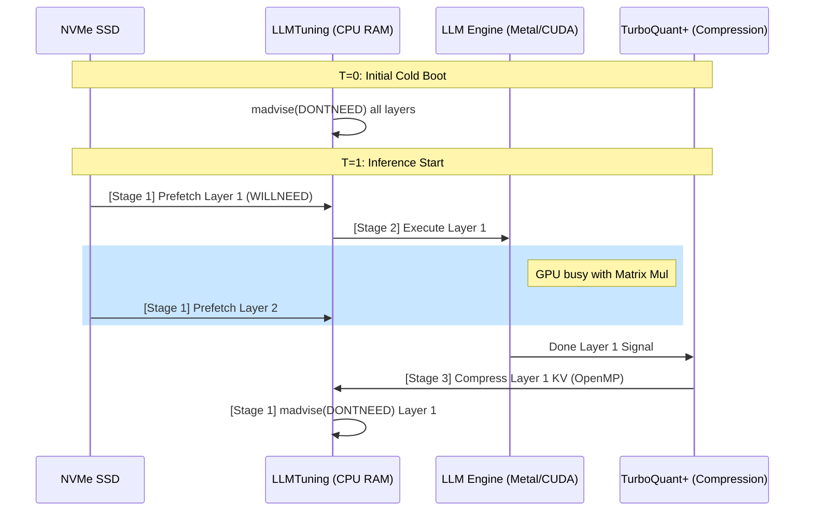

# TurboQuant+ Architectural Map 🗺️

This document details the interaction between the **LLMTuning Orchestration Layer** and the **TurboQuant+ Compression Core**.

---

## 🏗️ The 3-Stage Asynchronous Pipeline

The engine achieves high throughput by overlapping I/O, compute, and compression.

---

## 🧩 Component Breakdown

### 1. LLMTuning: Memory Virtualization
LLMTuning treats your physical RAM as a sliding window (a "Pulse") for the model weights stored on the SSD.

*   **Logic File**: `llama-llmtuning.cpp`
*   **Predictive Paging**: Uses `madvise(MADV_WILLNEED)` to warm up the OS page cache for the next layer's memory range while the GPU is processing the current one.
*   **Active Sharding**: Uses `madvise(MADV_DONTNEED)` to immediately mark processed weight pages as "reclaimable." This prevents the "Memory Pressure" spike that typically causes macOS to freeze.
*   **Native Discovery**: Periodically checks `hw.memsize` to adjust the memory budget dynamically if other applications are closed/opened.

### 2. TurboQuant+: Compression Core
TurboQuant+ ensures that the context (KV Cache) of the conversation doesn't consume all available VRAM.

*   **Logic File**: `llama-kv-cache-iswa.cpp`
*   **PolarQuant**: Transforms tensors using a precomputed Walsh-Hadamard rotation (`turbo-rotation-data.h`). This makes the data follow a Beta distribution, which is mathematically optimal for scalar quantization.
*   **Dual Acceleration**: Inference kernels run on the GPU, while the expensive Walsh-Hadamard and scaling logic runs on the CPU using specialized OpenMP loops.
*   **Sparse V**: A runtime optimization that identifies "dead" tokens (tokens with near-zero attention weights) and skips their dequantization step entirely.

---

## 📍 Memory Model: The 1.1GB RAM Secret

How does a 5GB model run in 1.1GB of physical RAM?

1.  **Repack Suppression**: We disable the redundant `CPU_REPACK` buffer that standard `llama.cpp` uses.
2.  **Mmap Zero-Copy**: Weights are mapped but not "touched" until absolutely necessary.
3.  **Active Evacuation**: The moment a layer's output is calculated, LLMTuning tells the kernel: "I'm done with this physical page."
4.  **KV Tightening**: The KV cache is compressed to 2-bits, occupying only ~15% of its original floating-point size.

| Layer Type | Storage | Access Pattern |
| :--- | :--- | :--- |
| **Active Layer** | GPU VRAM / RAM | Frequent Access (Matrix Mul) |
| **Next Layer** | RAM (Prefetch) | Sequential Read (WILLNEED) |
| **Previous Layer** | SSD (Swap) | Evacuated (DONTNEED) |
| **KV Cache** | RAM (Compressed) | Persistent but compact |

---

## 🚀 Data Flow Summary

1.  **User Prompt** triggers the first graph execution.
2.  **LLMTuning** fetches weight tensors from SSD using asynchronous prefetching.
3.  **LLM Engine** performs the transformer block math.
4.  **TurboQuant+** worker thread wakes up via a signal and compresses the newly generated KV tokens.
5.  **LLMTuning** unloads the weights of the finished block.
6.  **Repeat** until the EOS (End of Sequence) token is generated.
