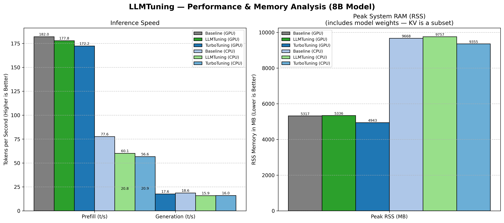

# TurboQuant+ // LLMTuning
### 2026 Yerel LLM Çıkarımı İçin Ekstrem Verimlilik Motoru

> **TurboQuant+** [[1]](https://github.com/TheTom/turboquant_plus) ve **LLMTuning** iki bağımsız ama tamamlayıcı teknolojidir. TurboQuant+ KV önbelleğini sıkıştırır, her token daha az bellek kullanır. LLMTuning model ağırlıklarını sanallaştırır, fiziksel RAM'den büyük katmanlar bile çalışabilir. Her ikisini ayrı ayrı ya da birlikte kullanabilirsiniz.

[Mimari Harita](MAP.md) | [Bellek / RSS Hedefleri](docs/memory-rss-targets.md) | [Yol Haritası](PLAN.md) | [English Guide](README.md)

---

## İki Teknoloji — ve Neden Farklılar

| | TurboQuant+ | LLMTuning |
|---|---|---|
| **Ne sıkıştırır** | KV önbelleği (dikkat anahtarları ve değerleri) | Model ağırlıkları (transformer katmanları) |
| **Nasıl** | Walsh-Hadamard rotasyonu + skaler kuantizasyon (2/3/4-bit) | `madvise(DONTNEED/WILLNEED)` — işletim sistemi sayfa tahliyesi |
| **Ne zaman yardımcı olur** | Uzun bağlam, büyük batch, VRAM taşması | Fiziksel RAM'den büyük modeller |
| **Diğeri olmadan çalışır mı?** | Evet — sadece `--cache-type-k turbo4 --cache-type-v turbo4` ekleyin | Evet — herhangi bir llama.cpp modeliyle çalışır |
| **Otomatik etkinleştirme** | Turbo önbellek türleri seçildiğinde her zaman aktif | Turbo önbellek türleri `turbo_async=true` tetiklediğinde otomatik aktif |
| **Çalışma maliyeti** | Her K/V yazımında CPU WHT rotasyonu; dikkat doğruluğu kaybı neredeyse sıfır | Arka plan I/O iş parçacığı; küçük önceden yükleme gecikmesi |

---

## Direk 1: TurboQuant+ (KV Önbellek Sıkıştırma)

TurboQuant+, ICLR 2026 makalesinden (arXiv 2504.19874) PolarQuant algoritmasını [[2]](https://arxiv.org/abs/2504.19874) uygular. KV önbellek belleğini 2,5× ile 6,4× arasında neredeyse kayıpsız kaliteyle azaltır.

### Nasıl çalışır — adım adım

**1. Walsh-Hadamard Dönüşümü (WHT)**

Kuantize etmeden önce her K veya V vektörü rastgele bir Hadamard matrisiyle döndürülür. Bu, enerjiyi tüm boyutlara eşit olarak dağıtır, dağılımı yaklaşık Gaussian (Beta dağılımı) yapar. Gaussian dağılımlar, ham, sivri transformer aktivasyonlarından çok daha iyi kuantize edilir.

- WHT O(d log d) karmaşıklığındadır — büyük kafa boyutları için bile hızlı
- Aynı rotasyon her katmanda sabit bir rastgele tohum ile uygulanır

**2. 2, 3 veya 4 Bit Skaler Kuantizasyon (turbo2 / turbo3 / turbo4)**

Rotasyondan sonra her eleman bir merkeznoktaya eşlenir. Üç tür desteklenir:

| Tür | Bit | f16'ya göre sıkıştırma | WHT depolama alanı | Kullanım durumu |
|---|---|---|---|---|
| `turbo2` | 2 | ~6,4× | WHT-döndürülmüş | Maksimum RAM tasarrufu |
| `turbo3` | 3 | ~4,9× | WHT-döndürülmüş | Dengeli |
| `turbo4` | 4 | ~3,76× | **Doğal alan** | En iyi kalite, varsayılan |

> **Önemli — turbo4 alan farkı**: turbo2 ve turbo3, K/V'yi WHT-döndürülmüş alanda depolar. turbo4, K/V'yi **doğal (döndürülmemiş) alanda** depolar. Bu şu anlama gelir:
> - turbo2/turbo3 K için: Q@K^T hesaplamadan önce Q'nun da WHT-döndürülmüş olması gerekir
> - turbo4 K için: Q doğal alanda kalmalıdır
> `llama-graph.cpp` grafik kodu bunu her katman için otomatik olarak yönetir.

**3. Metal GPU Çekirdekleri**

Apple Silicon'da, Flash Attention sırasında dequantizasyon Metal shader'ları içinde gerçekleşir. Vektörize olmayan FA yolu, turbo türleri için her zaman kullanılır (K≠V türü veya V herhangi bir turbo türü olduğunda vektörize yol devre dışı bırakılır). Çekirdekler: `kernel_flash_attn_ext_kturbo4_vturbo4`, `kernel_flash_attn_ext_kturbo4_vturbo2`, vb.

**4. CPU kuantizasyon yolu**

`ggml-turbo-quant.c` bir CPU yedek yolu sağlar. Kuantize etmeden önce `turbo_cpu_fwht()` uygular. CPU dequantize fonksiyonları döndürülmüş alanda kalır — ters WHT, çekirdek başına değil grafik seviyesinde uygulanır.

### TurboQuant+'ı tek başına çalıştırma (LLMTuning olmadan)

```bash
cd llama-cpp-turboquant
./build/bin/llama-cli \
    -m "../models/Meta-Llama-3.1-8B-Instruct-Q4_K_M.gguf" \
    -ngl 99 \
    -c 4096 \
    --cache-type-k turbo4 \
    --cache-type-v turbo4 \
    -cnv -sys "Yardımcı bir asistansın."
```

Bu, en basit ve en kararlı yapılandırmadır. LLMTuning gerekmez. Model, her zamanki gibi VRAM/RAM'e sığmalıdır — yalnızca KV önbelleği sıkıştırılır.

Asimetrik sıkıştırma için (daha yüksek K kalitesi, daha fazla V tasarrufu):

```bash
--cache-type-k turbo4 --cache-type-v turbo2
```

---

## Direk 2: LLMTuning (Bellek Sanallaştırma)

LLMTuning, LLM'niz için bir "işletim sistemi" görevi görür. Fiziksel RAM'i, SSD'de depolanan model ağırlıkları üzerinde kayan bir pencere olarak yönetir. Sonuç: 5GB'lık bir model, kararlı durumda 2GB'dan az fiziksel RAM ile çalışabilir.

### Nasıl çalışır — adım adım

**1. Soğuk Başlatma Tahliyesi**

Başlangıçta, model sanal belleğe mmap'lendikten sonra, LLMTuning hemen tüm transformer katman ağırlık sayfalarında `madvise(MADV_DONTNEED)` çağırır. Çekirdek bu fiziksel sayfaları serbest bırakır. Sanal adresler geçerli kalır — sayfalar isteğe göre diskten (veya mmap dosyasından) yeniden yüklenir.

**2. Tahminsel Sayfalama (WILLNEED)**

Her katman çalıştırılmadan önce, LLMTuning *sonraki* katmanın bellek bölgesinde `madvise(MADV_WILLNEED)` çağırır. İşletim sistemi, I/O ile GPU hesaplamayı örtüştürerek arka planda bu sayfaları SSD'den sayfa önbelleğine getirmeye başlar.

**3. Aktif Parçalama (DONTNEED)**

GPU bir katmanı bitirdikten hemen sonra, LLMTuning o katmanın ağırlıkları üzerinde `madvise(MADV_DONTNEED)` çağırır. Fiziksel RAM geri alınır. Herhangi bir anda yalnızca aktif katman + önceden yükleme tamponu fiziksel belleği işgal eder.

**4. Yerel Bütçe Keşfi**

LLMTuning, güvenli çalışma kümesi boyutunu belirlemek için `hw.memsize` (macOS) veya `/proc/meminfo` (Linux) okur. Demo betikleri bu bütçeden en uygun `-ngl` (GPU katmanları) ve batch boyutlarını hesaplar — `turboquant/cli_config_export.py` aracılığıyla `tq_cli_config.json`'a aktarılır.

### Otomatik Etkinleştirme

LLMTuning, herhangi bir turbo önbellek türü kullanıldığında otomatik olarak etkinleşir. Ayrı bir bayrak gerekmez — `--cache-type-k turbo*` veya `--cache-type-v turbo*` parametreleri, `turbo_async=true` üzerinden 3 aşamalı asenkron hattı (önceden yükleme → hesaplama → tahliye) tetikler.

Başlangıçta LLMTuning ayrıca **TQR (TurboQuant Repack)** önbellek dosyalarını yönetir. İlk çalıştırmada, sayfa hizalı yeniden paketlenmiş ağırlıkları `.tqr` dosyasına kaydeder. Sonraki çalıştırmalarda, sıfır tahsisli başlatma için bu dosyadan anında yükleme yapar. Farklı modellere ait eski TQR dosyaları otomatik olarak temizlenir.

### LLMTuning ile çalıştırma (demo betikleri)

```bash
# macOS
./run_turboquant_demo_macos.sh

# Linux
./run_turboquant_demo_linux.sh

# Windows
run_turboquant_demo.bat
```

Demo betikleri:
1. C++ motorunu Metal/CUDA/CPU bayraklarıyla derler
2. Model seçim menüsü sunar (Llama 3.1 8B, Qwen 2.5 32B, Command R+ 104B, GPT 20B, Gemma 4 31B, Qwen 2.5 Coder 7B, vb.)
3. Seçilen model yoksa indirir
4. LLMTuning doğrulama geçişi yapar (hattı doğrulamak için hızlı 50 token üretimi)
5. `llama-cli` ile ana interaktif oturumu başlatır

Windows'ta betik ek olarak `python -m turboquant.cli_config_export` çağırarak bellek katmanına duyarlı parametrelerle (ctx_len, önbellek türleri, batch boyutları, NGL) `tq_cli_config.json` oluşturur.

### Yalnızca TurboQuant+ ile TurboQuant+ + LLMTuning karşılaştırması

| Senaryo | Gereken RAM | Ne zaman kullanılır |
|---|---|---|
| Yalnızca TurboQuant+ | Tam model ağırlıkları + sıkıştırılmış KV | Model VRAM/RAM'e sığıyor; KV tasarrufu istiyorsunuz |
| TurboQuant+ + LLMTuning | ~1–2 aktif katman + önceden yükleme + sıkıştırılmış KV | Model fiziksel RAM'den büyük |
| Yalnızca LLMTuning (f16 KV) | ~1–2 aktif katman + tam f16 KV | Model çok büyük ama bağlam kısa |

**Somut örnek — 16GB MacBook'ta Llama 3.1 8B:**

| Yapılandırma | VRAM | Tepe RSS |
|---|---|---|
| Standart llama.cpp (f16 KV, tüm katmanlar) | 5 GB ağırlık + 2 GB KV | ~7–8 GB |
| Yalnızca TurboQuant+ (turbo4/turbo4, tüm katmanlar) | 5 GB ağırlık + ~0,5 GB KV | ~5,5 GB |
| TurboQuant+ + LLMTuning (Ultra-Eco) | ~1 GB aktif + ~0,5 GB KV | ~1,5 GB tepe RSS |

---

## Hızlı Başlangıç

### Gereksinimler
- **macOS**: Xcode Komut Satırı Araçları, Python 3.10+, Homebrew (`brew install libomp`)
- **Linux**: GCC/Clang, CMake 3.21+, OpenMP
- **Windows**: MSVC 2022, CMake

### Derleme

```bash
cd llama-cpp-turboquant

# macOS (Metal + OpenMP)
cmake -B build -DGGML_METAL=ON -DGGML_METAL_EMBED_LIBRARY=ON -DCMAKE_BUILD_TYPE=Release
cmake --build build -j --target llama-cli

# Linux CUDA
cmake -B build -DGGML_CUDA=ON -DCMAKE_BUILD_TYPE=Release
cmake --build build -j --target llama-cli
```

### Çalıştırma

```bash
# En basit — yalnızca TurboQuant+
./build/bin/llama-cli -m "../models/Meta-Llama-3.1-8B-Instruct-Q4_K_M.gguf" -ngl 99 -c 512 --cache-type-k turbo4 --cache-type-v turbo3 -sys "Sen yardımcı bir asistansın. Her zaman Türkçe ve teknik detay vererek cevap ver." -p "Hello! What is 2+2?" -n 50 --no-display-prompt

# LLMTuning ile tam demo
cd ..
./run_turboquant_demo_macos.sh
```

---

## Desteklenen Modeller

Demo betikleri aşağıdaki modeller için önceden yapılandırılmış profiller içerir:

| Model | Boyut | GGUF Quant | Notlar |
|---|---|---|---|
| Llama 3.1 8B Instruct | ~5 GB | Q4_K_M | Varsayılan seçim |
| Qwen 2.5 32B Instruct | ~20 GB | Q4_K_M | 32GB+ RAM gerekli |
| Command R+ 104B | ~43 GB | Q2_K | Ekstra — 64GB+ gerekli |
| Qwen 2.5 0.5B Instruct | ~400 MB | Q4_K_M | Hızlı test |
| GPT 20B (OpenAI OSS) | ~12 GB | Q4_K_M | Sohbet şablonu yok |
| Gemma 4 31B (Google) | ~18 GB | Q4_K_M | Yalnızca macOS |
| Qwen 2.5 Coder 7B | ~5 GB | Q4_K_M | Kod odaklı |

## Kilometre Taşları

- **Ultra-Eco Modu**: 16GB sistemlerde 8B modeller ~1,5GB tepe RSS ile çalışıyor
- **Yüksek Bağlam**: 128GB MacBook'ta 128K bağlamda 104B modeller
- **Düşük RAM Kararlılığı**: 24GB M2/M3 çiplerinde 70B modellerin kararlı çıkarımı

---

## Benchmark


## Kaynakça

1. Turney, T. (2026). *TurboQuant+: Extreme-Efficiency Inference Engine for Large Language Models*. GitHub repository. [https://github.com/TheTom/turboquant_plus](https://github.com/TheTom/turboquant_plus)
2. *PolarQuant Algorithm*. ICLR 2026. (arXiv:2504.19874)

---

## Katkı

Bu proje `llama.cpp`'nin deneysel bir çatallamasıdır. Araştırma yol haritası için [PLAN.md](PLAN.md)'ye bakın.

**Lisans**: Apache 2.0. Telif Hakkı 2026 Tom Turney.
